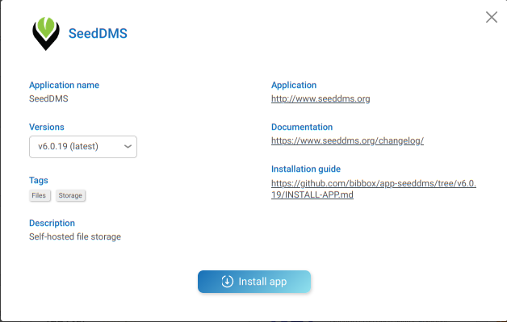
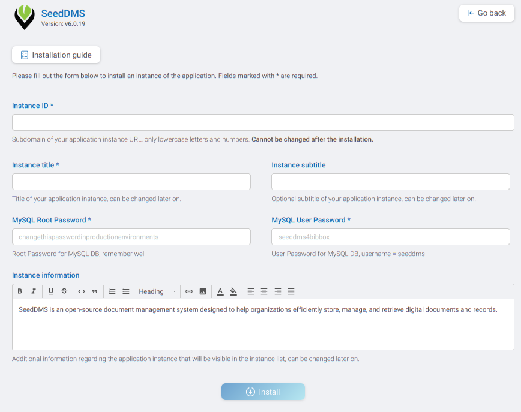

## SEEDDMS Installation Instructions 

* The application can be installed either within the BIBBOX environment or as a stand-alone solution. Installation instructions can be found within the BIBBOX, followed by setup instructions required once the application has been successfully installed.

## Installation within in the BIBBOX

* Once you've selected the desired App for your BIBBOX instance, you can choose from the available versions, as shown in the following figure.

* Clicking "Install App" will open a new window, as illustrated in the following figure. Here, you can define the necessary entries. Some fields come pre-filled with suggested options, and if left unchanged, these default values will be used as the entries.

* After confirming by clicking "Install," the App will be installed as a BIBBOX instance. Once the installation is complete, you only need to follow a few steps to use the App for the first time, which are described below.

* As soon as SeedDMS has been installed within the BIBBOX, you can launch it from the Applications menu.

* A new Tab will open in your browser and show you a blank page with a warning to use the SeedDMS installer.

* From the current URL navigate to **/install/install.php** through the browser's address bar. Here you will find the installers welcome page. 
Update the password for the database settings as you specified in the App installation screen and 
make sure to check **Create database tables** and click **Apply**!

* After the installation has succeeded, another screen with two links will appear. 
Click on **Delete the ENABLE_INSTALL_TOOL if possible**.

* The setting for forcing the installation will now be deleted and the application is ready for usage. Click on **Configure more settings. Default login: admin/admin**.

* You will now see the login screen. Please use username **admin** and password **admin** to log in.

* That's it! You have successfully installed SeedDMS and are ready for managing your documents with it!

## Backup instructions

* Backup the database App directory, replace APPID with the id (subdomain) of the installed app. 

        /opt/bibbox/application-instance/APPID-app-seeddms
        
* Backup the data directory 
    
        /opt/bibbox/application-instance/APPID-app-seeddms/data/var/www/seeddms60x
        
* Backup the mysql database with the command
       
       docker exec  APPID-seeddms-db /usr/bin/mysqldump -u root --password='YOURROOTPASSWORD' seeddms > /home/vmadmin/seeddmsbackup.sql

   if you forgot the database root password, you can lookup it in the docker-compose file. 
   
        /opt/bibbox/application-instance/APPID-app-seeddms/docker-compose.yml

## After the installation

Have a nice ride with the new Admins youngtimer.

