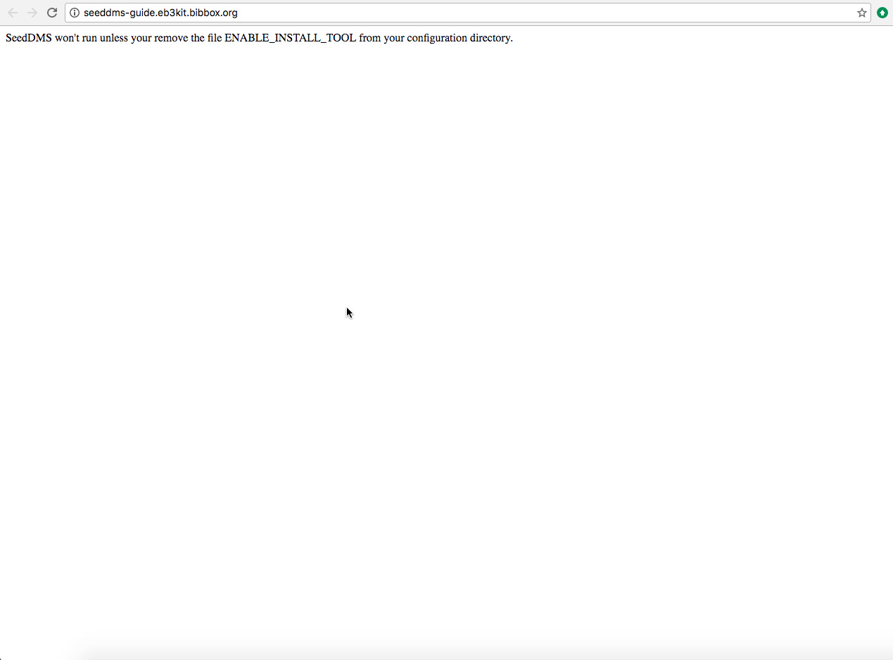
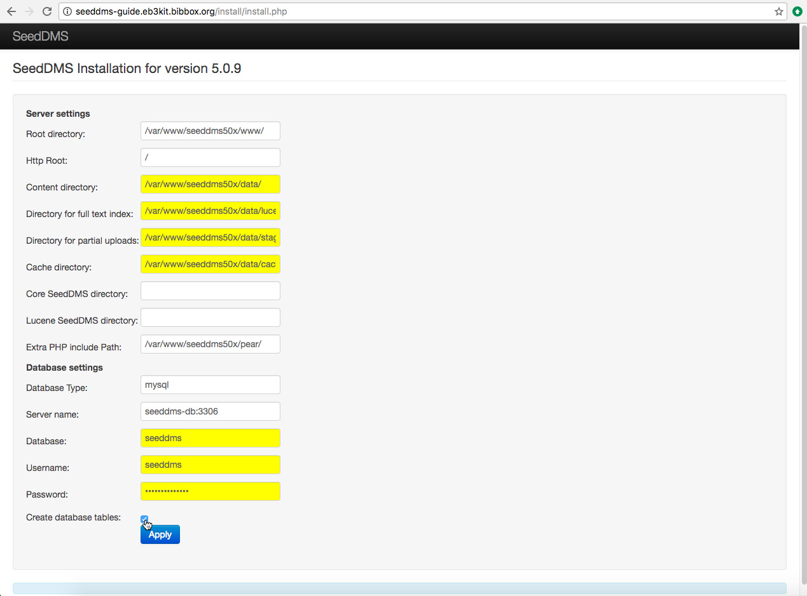
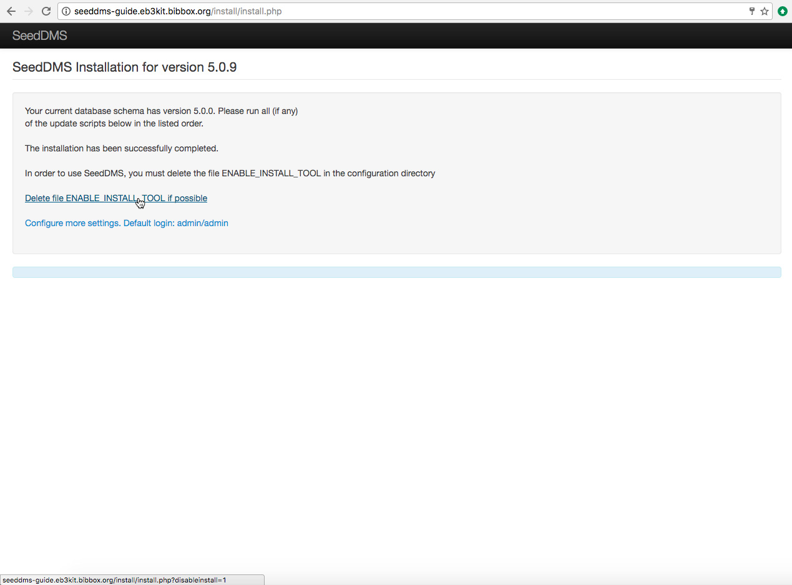
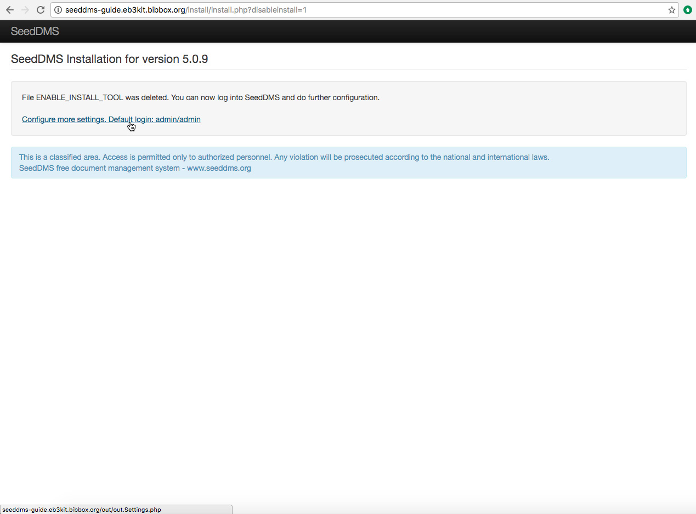
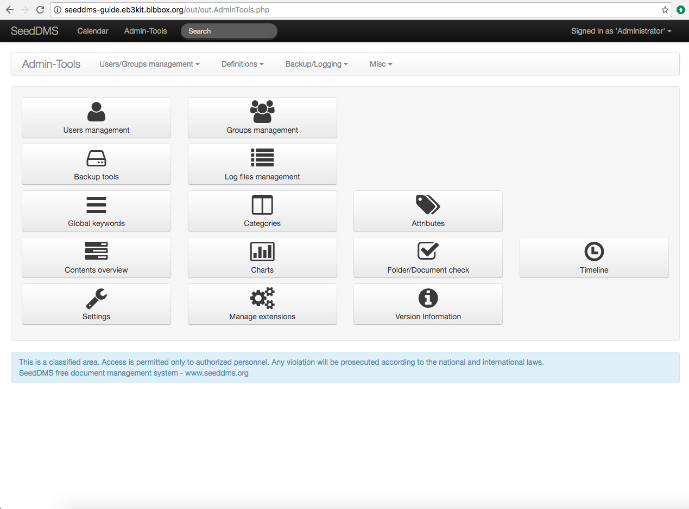

## SEEDDMS Installation Instructions 

* As soon as SeedDMS has been installed within the BIBBOX, you can launch it from the Applications menu.

* A new Tab will open in your browser and show you a blank page with a warning to use the SeedDMS installer.

* From the current URL navigate to **/install** through the browser's address bar. Here you will find the installers welcome page. Klick on **Start installation**.

* On the next page a form for configuring installation paths will appear. Just leave it as it is but make sure to check **Create database tables** and click **Apply**!

* After the installation has succeeded, another screen with two links will appear. Click on **Delete the ENABLE_INSTALL_TOOL if possible**.

* The setting for forcing the installation will now be deleted and the application is ready for usage. Click on **Configure more settings. Default login: admin/admin**.

* You will now see the login screen. Please use username **admin** and password **admin** to log in.

* That's it! You have successfully installed SeedDMS and are ready for managing your documents with it!

## After the installation

Have a nice ride with the new Admins youngtimer.

